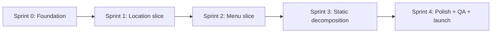

# Development Plan — Kita Chili Dogs

**Source docs:** `prd.md` (Sprint Plan §12), `ddd.md`, `erd.mermaid`, `readiness-assessment.md`
**Approach:** Vertical slices per the PRD — each sprint delivers a complete, demoable feature (DB → backend → admin UI → public UI). Work proceeds in order below; each sprint ends with tests passing and a demoable outcome.

---

## Sprint 0 — Foundation (complete the scaffold)

> Goal: Deployable, single-admin skeleton. Logged-out visitor sees the public shell; owner can log in and see an empty admin dashboard.

### 0.1 Restrict to a single admin (no public sign-up)

- Remove/guard the `register` GET/POST routes in `routes/auth.php`.
- Remove the registration link from `GuestLayout.vue` (Breeze shows a "Register" link on Login).
- Optionally delete `Register.vue`, `RegisteredUserController.php`, and the `RegistrationTest.php` (or repurpose).
- Keep `User` as the admin identity — no roles table needed (DDD §4.4).

### 0.2 Seed a single admin account

- Update `database/seeders/DatabaseSeeder.php` to create a deterministic admin (e.g. `admin@kitachilidogs.jp`) instead of / in addition to `Test User`. Never seed in production guardlessly — read from `.env` or a config value.

### 0.3 Build the `/admin` protected shell

- Route group `Route::prefix('admin')->middleware(['auth','verified'])` in `routes/web.php` → `name('admin.')`.
- Replace/repurpose the stock Breeze `/dashboard` with an `Admin/Dashboard` page (or add `/admin` rendering `Admin/Dashboard.vue`).
- Add an `AdminLayout.vue` (reuse Breeze `AuthenticatedLayout.vue` or build a plain unbranded admin shell per PRD §6.3 — standard forms/tables, no editorial branding).
- Add an admin nav with links to the (soon) Location & Menu areas.
- **Outcome check:** owner logs in, lands on empty dashboard; public `/` shows the shell page.

---

## Sprint 1 — Location Vertical Slice (Core Domain #1)

> Goal: Owner can add today's stop in `/admin/locations` and see it live on the public site.

### 1.1 Migration — `locations`

Create `create_locations_table`. Columns per ERD, with invariants expressed at the schema level where possible:

- `id` PK
- `schedule_date` **date**, `unique` (one entry per calendar date)
- `location_name`, `address` (varchar)
- `landmark_note` nullable
- `start_time`, `end_time` (time)
- `latitude`, `longitude` (decimal, nullable-or-required — decide policy)
- `map_pin_note`, `transit_note` nullable
- `is_event` bool, `event_name` nullable (nullable is schema-only; invariant enforced in model)
- `status` enum `['scheduled','cancelled']` default `scheduled`
- `created_at`, `updated_at`

### 1.2 Model — `LocationEntry`

- `App\Models\LocationEntry`, `$fillable`/`casts()` for date + times.
- **Model/domain invariants (DDD §4.1):**
  - Validate `start_time < end_time`.
  - Validate `event_name` required when `is_event = true`.
  - Expose a scoped/public query: "today's scheduled entry" = `schedule_date = today && status = scheduled`. Cancelled ⇒ treated as Rest Day (invariant #4).
- Keep a non-default `$table` if naming it `Location`; consider naming the model `LocationEntry` to match the DDD aggregate while `$table = 'locations'`.

### 1.3 Admin — Location CRUD

- `LocationController` with index/create/store/edit/update (and a `cancel` action rather than delete, to preserve history per DDD §4.1 status lifecycle). Keep delete optional/soft via status.
- A `LocationRequest` Form Request enforcing the invariants (duplicate `schedule_date`, time ordering, event-name rule).
- Pages under `resources/js/Pages/Admin/Locations/` — a calendar/date-picker index plus a create/edit form. Filterable by status (scheduled/cancelled) for the owner's history view.
- Calendar edge cases (Sprint 4 handles polish): duplicate-date prevention, past-date handling.

### 1.4 Public — data-driven `LocationSchedule.vue`

- Extract the §3 markup out of `Welcome.vue` into `LocationSchedule.vue` driven by a `location` prop.
- **Remove** the "Simulate Holiday / Closed" toggle and **remove** the future-date "Next Service" copy (out-of-scope, PRD §3).
- Two states from data:
  - **Scheduled today:** render exact copy `"[Day], [Month] [Date] — Today we'll be at [Location] ([landmark note]), from [start] to [end]"` + address, transit note, embedded map from lat/long, map pin caption.
  - **Rest day** (no scheduled entry): calm holiday message, no map/time.

### 1.5 Controller wiring — public `/`

- In the `/` route (or a `PublicController`), query `LocationEntry` for today's scheduled entry and pass as an Inertia prop `todayLocation` (or `null`).
- **Outcome check:** owner adds a stop for today in admin → public Location section reflects it; remove it/cancel → holiday state.

---

## Sprint 2 — Menu Vertical Slice (Core Domain #2)

> Goal: Owner manages the menu; public menu + Hero popular item reflect it live.

### 2.1 Migration — `menu_items`

Columns per ERD:

- `id` PK, `name`, `slug` **unique**
- `description` text
- `price_yen` int (whole yen, positive)
- `image_url`, `image_alt_text`
- `spice_level` enum `['mild','medium','hot','tangy']`
- `category` enum — the two v1 values (confirm exact pair, e.g. `chili_dog`/`drink`)
- `badge_type` enum `['halal_standard','limited_batch','none']`
- `highlight_tag_1`, `highlight_tag_2` nullable
- `is_popular` bool (default false), `is_sold_out` bool (default false), `is_active` bool (default true)
- `display_order` int
- `created_at`, `updated_at`

### 2.2 Model — `MenuItem`

- `App\Models\MenuItem` with `$fillable`/`casts()`.
- **Domain invariants (DDD §4.2):**
  - `price_yen` positive whole number.
  - `slug` auto-generated & unique (with `Str::slug` uniqueness handling).
  - `category` in allowed set.
  - `is_active = false` excluded from **all** public queries (grid + Hero popular), precedence over `is_popular`.
  - `is_sold_out` independent of `is_active`.
  - Media: image + non-empty alt required for publishable items (validation, since v1 admin sets both).

### 2.3 Domain service — `MenuFeaturingService`

- `App\Services\MenuFeaturingService` with `feature(MenuItem $item)`:
  - Within a transaction: clear `is_popular` on the current holder, then set `is_popular = true` on the target.
  - **Admin "Feature this item" action must call this service**, never toggle `is_popular` directly (DDD §4.2).

### 2.4 Admin — Menu CRUD

- `MenuItemController` index/create/store/edit/update.
- `MenuItemRequest` (or `StoreMenuItemRequest`/`UpdateMenuItemRequest`) validating per invariants (price, category enum, alt text, sold-out/active toggles, display order, image upload or URL).
- File/image storage decision (local `storage` or S3) — keep simple; store optimized images, wire alt text.
- Pages under `resources/js/Pages/Admin/Menu/` — table index (with reorder, feature, sold-out, active controls) + create/edit form.
- **Feature action routes through `MenuFeaturingService`.**

### 2.5 Public — data-driven Menu & Hero

- Extract §4 markup into `MenuGallery.vue` rendering **`MenuCard.vue`** per item (`v-for`) from a `menuItems` prop (only `is_active = true`, ordered by `display_order`). Each card: image, name, price ¥, spice, description, 2 highlight tags, badge, sold-out overlay.
- Extract §2 Hero dynamic parts: Hero's popular item = the single `is_popular && is_active` item (from backend), reusing `MenuCard.vue` (or a hero variant). Hero's event pill = nearest upcoming `is_event` entry.
- **Outcome check:** owner adds/edits menu, toggles popular/sold-out/active in admin → public grid + Hero update.

---

## Sprint 3 — Static Content Sections (decomposition)

> Goal: All 8 public sections complete and content-accurate; `Welcome.vue` no longer monolithic.

### 3.1 Componentize the remaining static sections

- Split §2 (Hero, after dynamic parts extracted in 2.5), §5 → `AboutStory.vue`, §6 → `AllergenInfo.vue`, §7 → `Faq.vue` rendering **`FaqItem.vue`** (accordion, one-open-at-a-time state + ARIA).
- Optionally extract Nav (§1) → `Navigation.vue` and Footer (§8) → `Footer.vue` out of `PublicLayout.vue` for parity with the named-component structure (PRD §6.2/§11).
- Reassemble: `Welcome.vue` (or `Home.vue`) becomes a thin composition of the section components, receiving the data props from the controller.
- Move final static copy (About/Allergen/FAQ/footer text) into the components.
- **Outcome check:** page renders identically to the current prototype but is composed of the specified component tree.

---

## Sprint 4 — Polish, QA & Launch

> Goal: Launch-ready site.

### 4.1 Responsiveness & performance

- Mobile-first pass across all sections.
- Image optimization + lazy-loading for Menu gallery & Hero.
- Map iframe lazy-loading.

### 4.2 SEO & accessibility

- Page title / meta description / local keywords (e.g. "halal food truck Sapporo").
- Alt text audit, keyboard-navigable nav & accordion, accordion ARIA states.

### 4.3 Map provider key

- Replace hardcoded Google Maps embed with a configured map provider key (env/`config/services`), per NFR §9 / §10.

### 4.4 Edge-case QA

- Empty menu state, holiday state, sold-out items, long-text overflow, inactive popular item (never shows), duplicate/past calendar dates.

### 4.5 Admin UI QA

- Unbranded utility UI confirmation, form validation, calendar edge cases.

### 4.6 Feature tests

- `LocationEntryTest`: one-per-date, time ordering, event-name rule, cancelled = rest day, public query today-only.
- `MenuItemTest`: slug uniqueness, price rule, active-precedence, sold-out independence, `MenuFeaturingService` single-popular guarantee, admin feature flow.
- Regression: Breeze auth tests still pass.

### 4.7 Launch

- Production deployment, domain/hosting, map key, run `npm run build` + migrations + seeder.

---

## Suggested Execution Order & Dependencies

- **Sprint 0 must land first** — it unlocks single-admin auth and the `/admin` boundary everything else hangs off.
- **Sprint 1 before Sprint 2** — Location is the highest-value, most time-sensitive feature (PRD rationale) and is fully independent of Menu.
- **Sprint 3 last among feature sprints** — static content carries no backend risk and can flex if time pressure hits (PRD rationale).
- **Sprint 4** is the only sprint that cannot begin meaningfully until 1–3 exist, because it QA's live data flows.

---

## Cross-Cutting Notes (apply every sprint)

- **DDD invariants live in models / domain services, not controllers** (DDD §6). Each slice ships its invariants with its migration.
- **Admin UI language mirrors the Ubiquitous Language** (DDD §2): labels/toggles = "Location Entry/Stop", "Rest Day", "Event", "Menu Item", "Popular", "Sold Out", "Active".
- **Keep the two core domains decoupled** — `LocationEntry` and `MenuItem` never reference each other; only the public presentation layer reads both (DDD §5).
- **Commit `Welcome.vue` as the design reference**, do not delete until Sprint 3 composition is pixel-complete.
- Run `composer run dev` / `npm run build` and `artisan test` at the end of every sprint to confirm the vertical slice is green.
