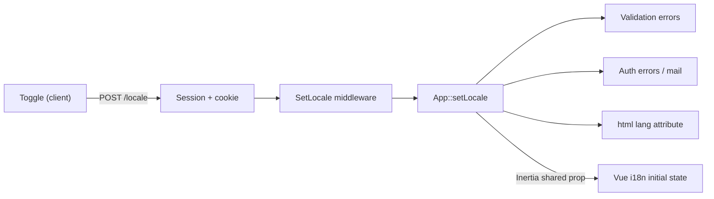

# Japanese Localization Plan

**Project:** Kita Halal Chili Dogs Sapporo
**Status:** Agreed, ready to implement
**Last updated:** 2026-09-18

> All file paths are relative to the `project/` directory (the Laravel application root).

---

## 1. Locked decisions

| #   | Decision                                                                      | Rationale                                                                                                                                           |
| --- | ----------------------------------------------------------------------------- | --------------------------------------------------------------------------------------------------------------------------------------------------- |
| 1   | **Japanese is the primary language. English is supplementary.**               | The business operates in Sapporo; the local market is the primary audience.                                                                         |
| 2   | **English is available only on the public landing page**, via a toggle.       | Every form in the application is staff-facing (public registration is already disabled — see `routes/auth.php`), so no other surface needs English. |
| 3   | **No locale prefix in URLs.** The toggle is client-side rendering.            | Content is single-language, so splitting URLs would create duplicate content for no benefit.                                                        |
| 4   | **The server tracks the active locale** via session + cookie.                 | Required for validation messages, auth errors, and mail — none of which can be produced client-side.                                                |
| 5   | **Database content stays single-language (Japanese), entered by the client.** | No schema change, no translation columns, no translatable-content layer.                                                                            |
| 6   | **Admin, authentication, and profile screens are Japanese only.**             | Staff-facing. Removes roughly 70 English keys and half the label work.                                                                              |
| 7   | **No browser-language auto-detection.** First visit is always Japanese.       | Many Japanese residents run an English-language OS; detection would serve English to the core audience.                                             |
| 8   | **An English visitor sees English labels around Japanese content.**           | Agreed explicitly with the client as an accepted outcome, not a defect.                                                                             |
| 9   | **The brand is `キタハラルチリドッグス` in all Japanese text.**               | Two competing Japanese names existed; see §6. Shortened from `キタハラルチリドッグス札幌`, which was too wide for the header nav.                   |

---

## 2. Language matrix

| Surface                                     | Language                                           |
| ------------------------------------------- | -------------------------------------------------- |
| Public landing page (`/`)                   | JA + EN (toggle)                                   |
| Admin dashboard and forms (`/admin/*`)      | JA only                                            |
| Login / password reset / email verification | JA only                                            |
| Profile screens (`/profile`)                | JA only                                            |
| Validation errors, auth errors, mail        | JA only                                            |
| Database content (menu items, locations)    | JA only — authored by the client, never translated |
| Japanese consumers / `<html lang>`          | **JA becomes the effective site language**         |

### SEO consequence (positive)

Making Japanese the default resolves the search-visibility problem rather than working around it:

- Google indexes the Japanese page, which is the correct page for the Sapporo market.
- The English view is a client-side toggle, **not a URL** — so there is no duplicate content, no `hreflang` requirement, and no locale-segmented sitemap.
- Remaining work is limited to correcting metadata that is currently English.

---

## 3. Architecture



**Resolution order:** URL locale (unused today) → session → cookie → `APP_LOCALE` (`ja`).

The browser and the server read the same value from the same source, which removes the class of bug where the UI shows Japanese while the server emits English validation errors.

---

## 4. Change inventory

### A. Language plumbing — new, small

| File                                            | Change                                                                                                                                  |
| ----------------------------------------------- | --------------------------------------------------------------------------------------------------------------------------------------- |
| `.env` / `.env.example`                         | `APP_LOCALE=ja`, `APP_FALLBACK_LOCALE=en`                                                                                               |
| `lang/ja/validation.php`                        | **New.** Messages plus the `attributes` map (see §5)                                                                                    |
| `lang/ja/auth.php`                              | **New.** Login/auth failure messages                                                                                                    |
| `lang/ja/passwords.php`                         | **New.** Password reset status messages                                                                                                 |
| `app/Http/Middleware/SetLocale.php`             | **New.** Resolves and applies locale from an allowlist                                                                                  |
| `app/Http/Middleware/ForceLocale.php`           | **New.** Pins JA on staff route groups so admin never follows the public toggle                                                         |
| `bootstrap/app.php`                             | Register both middleware in the `web` group                                                                                             |
| `routes/web.php`                                | `POST /locale` to persist the toggle                                                                                                    |
| `app/Http/Middleware/HandleInertiaRequests.php` | Share `locale` in `share()`                                                                                                             |
| `resources/views/app.blade.php`                 | **No change.** Already emits `app()->getLocale()`; it has been silently emitting `en` and will start working once the middleware exists |
| Password reset notification                     | JA subject and body (Breeze default is English)                                                                                         |

**No `lang/en/` directory is needed.** Laravel 12 ships English translations inside the framework at `vendor/laravel/framework/src/Illuminate/Translation/lang/en/`.

### B. `resources/js/i18n.js` — approximately 30 lines

- Default locale: `'en'` → `'ja'` (currently a first-time Japanese visitor gets an English first paint).
- Initial state read from the Inertia shared prop instead of `localStorage`.
- **Add `{param}` interpolation to `t()`** — required for the location headline (§4C).
- `toggleLocale()` persists to the server while still updating reactively, so the UX stays instant with no page reload.
- Keep `document.documentElement.lang` in sync.
- The `en` table shrinks to landing-page-only coverage.

### C. Public landing page — the only bilingual surface

| File                                     | Work                                                                                                                                                        |
| ---------------------------------------- | ----------------------------------------------------------------------------------------------------------------------------------------------------------- |
| `Components/Public/Hero.vue`             | Fallback headline and description, badge text, `money()` locale, `alt` text                                                                                 |
| `Components/Public/MenuCard.vue`         | `Sold Out`, 4 spice labels (`Mild`/`Medium`/`Hot`/`Tangy`), 2 badge labels (`Limited Daily Batch`, `Muslin Friendly`), price uses `toLocaleString('en-US')` |
| `Components/Public/MenuGallery.vue`      | Filter labels and empty state                                                                                                                               |
| `Components/Public/AboutStory.vue`       | ~400 words of prose, photo caption, `alt` text                                                                                                              |
| `Components/Public/AllergenInfo.vue`     | Full allergen table body                                                                                                                                    |
| `Components/Public/Faq.vue`              | 5 Q&A pairs (~600 words) plus subtitle — currently trapped inside the component                                                                             |
| `Components/Public/LocationSchedule.vue` | **Structural change — see below**                                                                                                                           |
| `Layouts/PublicLayout.vue`               | JA `<title>`, meta description, keywords, `og:locale=ja_JP` + `og:locale:alternate=en_US`, 3 `aria-label`s                                                  |
| `Pages/Welcome.vue`                      | `title` prop → Japanese                                                                                                                                     |

#### `LocationSchedule.vue` — the only genuine refactor

The headline is an English sentence with interpolated values:

```js
`${fmtDayMonth(loc.schedule_date)} — Today we'll be at ${loc.location_name}${landmark}, from ${hm(loc.start_time)} to ${hm(loc.end_time)}`;
```

Word-order substitution cannot translate this. It becomes a key with parameters — `t('loc.headline', { date, name, landmark, from, to })` — with the Japanese message providing correct word order. `nextLabel` needs the same treatment, and `fmtDayMonth` switches from `'en-US'` to `'ja-JP'` so dates render as `9月17日(水)`.

### D. Staff surfaces — Japanese text, English removed

| File                              | Work                                                                                                                                      |
| --------------------------------- | ----------------------------------------------------------------------------------------------------------------------------------------- |
| `Pages/Admin/Locations/Index.vue` | 14 hardcoded `<label>`s (`Date`, `Location name`, `Landmark note`, `Map pin note`, `Transit note`, …)                                     |
| `Pages/Admin/Menu/Index.vue`      | 14 hardcoded `<label>`s (`Image alt text`, `Spice level`, `Display order`, `Highlight tag 1`, …) plus `<Head title>`                      |
| `Pages/Admin/Accounts/Index.vue`  | `<Head title>`, `Confirm Password`, native `confirm()` dialog                                                                             |
| `Pages/Admin/Dashboard.vue`       | `<Head title>`                                                                                                                            |
| `Layouts/AdminLayout.vue`         | Remove the language toggle (admin is always JA); translate `aria-label`                                                                   |
| `Pages/Auth/*`                    | `ResetPassword.vue`, `ConfirmPassword.vue`, `VerifyEmail.vue` have **zero** keys today; `Login.vue` / `ForgotPassword.vue` partially done |
| `Pages/Profile/*`                 | `Edit.vue` plus 3 partials, **zero** keys, including `placeholder="Password"`                                                             |
| `Pages/Dashboard.vue`             | **Delete.** Dead Breeze leftover — `/dashboard` redirects via `PublicController@dashboardRedirect`                                        |

### E. Japanese typography

The current font stack (`Outfit`, `Plus Jakarta Sans`) contains no kana or kanji, so Japanese is already falling back to Hiragino/Yu Gothic — producing inconsistent headings across macOS, Windows, and Android.

- Add a `:lang(ja)` font stack (e.g. `Noto Sans JP`).
- Neutralize `uppercase tracking-widest` on section eyebrows — meaningless for Japanese and visually wrong on kanji.
- Body line-height 1.625 → approximately 1.8.
- `word-break` handling for long Japanese strings.

### F. Guardrails

- **Key-parity test:** fail when `ja` lacks a key that `en` has. The direction matters — with `ja` as the active locale and `en` as `fallback_locale`, a missing JA key silently renders English. That was graceful degradation when JA was secondary; it is now a visible defect in the primary language.
- Move FAQ and About prose from components into `lang` files so translators and tooling can see it.

---

## 5. Validation messages

`lang/ja/validation.php` alone produces 「name フィールドは必須です。」 — an English field name inside a Japanese sentence. The `attributes` map is what corrects it, and it is the item most commonly missed.

| Field            | JA label           | Field                     | JA label            |
| ---------------- | ------------------ | ------------------------- | ------------------- |
| `name`           | お名前             | `schedule_date`           | 日付                |
| `email`          | メールアドレス     | `location_name`           | 場所名              |
| `password`       | パスワード         | `address`                 | 住所                |
| `price_yen`      | 価格               | `landmark_note`           | 目印                |
| `description`    | 説明               | `start_time` / `end_time` | 開始時刻 / 終了時刻 |
| `image`          | 画像               | `event_name`              | イベント名          |
| `image_alt_text` | 画像の代替テキスト | `latitude` / `longitude`  | 緯度 / 経度         |

These cover `LocationRequest`, `MenuItemRequest`, `ProfileUpdateRequest`, and every request under `app/Http/Requests/Auth/`.

---

## 6. Brand name standardization

**Standard: `キタハラルチリドッグス`** (shortened from `キタハラルチリドッグス札幌`, which did not fit the header nav) — used everywhere the brand appears, in both languages. The header wordmark is no longer locale-dependent and always renders the Japanese name.

Current inconsistencies to correct:

| Location                             | Current                                                  | Action                                                                                                    |
| ------------------------------------ | -------------------------------------------------------- | --------------------------------------------------------------------------------------------------------- |
| `i18n.js` → `auth.signInHint`        | `キタチリドッグスの管理画面にログインします。`           | **Done** — replaced with the standard name                                                                |
| `i18n.js` → `foot.rights`            | `© 2026 キタハラルチリドッグス札幌 All rights reserved.` | **Done** — name kept, English legal suffix removed (JA is primary)                                        |
| `PublicLayout.vue`                   | Latin wordmark `KITA CHILI DOGS`                         | **Done** — replaced with the Japanese brand name; size reduced so 10 full-width characters fit the header |
| `PublicLayout.vue`, `AboutStory.vue` | `aria-label`s and `alt` text using the Latin brand name  | Logo `aria-label` **done**; `AboutStory.vue` `alt` text pending Phase 2                                   |

Related terminology drift to resolve at the same time:

| Keys                                    | Current                                                                  | Action                                     |
| --------------------------------------- | ------------------------------------------------------------------------ | ------------------------------------------ |
| `nav.dietary` vs `mnav.dietary`         | `ハラル・アレルギー` vs `ハラル認証・アレルギー`                         | Same destination, two labels — unify       |
| `admin.dash.tip` + `admin.dash.profile` | One sentence split across two keys, ending mid-clause at 「…の場合は、」 | Merge into a single key with interpolation |

---

## 7. Phasing

| Phase | Work                                                                                | Effort |
| ----- | ----------------------------------------------------------------------------------- | ------ |
| **0** | Lock the glossary and brand name; client reviews existing JA strings                | S      |
| **1** | Language plumbing (§4A) plus `i18n.js` changes (§4B)                                | M      |
| **2** | Public landing page extraction (§4C), including the `LocationSchedule.vue` refactor | M      |
| **3** | Staff surfaces (§4D) and deletion of dead `Dashboard.vue`                           | M      |
| **4** | Japanese typography pass (§4E)                                                      | S      |
| **5** | Translation QA with the client; key-parity test; locale live check                  | S      |

**Ordering constraint:** Phase 1 must land before Phase 2. The moment `APP_LOCALE=ja` takes effect, every admin form begins producing Japanese validation messages — which surfaces the `attributes` gap (§5) immediately.

---

## 8. Explicitly out of scope

- **No database changes.** No migrations, no schema edits, no locale columns, no translation tables. `menu_items` and `locations` keep their exact current structure.
- No URL restructuring, no `hreflang`, no locale-separated sitemap, no duplicate-content handling.
- **No new Composer or npm dependencies.**
- No changes to `MenuFeaturingService`, controller logic, or existing tests.
- No English content for menu items or locations.
- No new public booking or contact form (the footer link remains an email link).

---

## 9. Open items

1. **The ~1,000 words of new Japanese copy** — **drafted and out for client review** in `.context/ja-copy-review.md` (2026-09-19). It carries the JA draft block by block, the EN source beside it, a locked glossary, the terminology conflicts found, and 13 fact-check items. Sprint 4 stays blocked until it returns.
2. **Allergen and halal certification wording must be reviewed by the client.** These are regulated claims; machine translation is not acceptable for this section.

---

## 10. Risks

| Risk                                                                   | Mitigation                                                           |
| ---------------------------------------------------------------------- | -------------------------------------------------------------------- |
| Missing JA key silently falls back to English, in the primary language | Key-parity test in Phase 5                                           |
| Brand/terminology drift re-emerging as new strings are added           | Glossary locked in Phase 0; enforced in review                       |
| Japanese typography regressions across platforms                       | `:lang(ja)` font stack plus a cross-platform visual check in Phase 4 |
| Form error text reading as machine-translated Japanese                 | `attributes` map (§5) plus client review of the JA message files     |
| Scope creep into content translation, which was explicitly excluded    | §8 recorded in writing                                               |

---

## 11. Sprint plan — vertical slices

§7 lists the work **horizontally** (all plumbing, then all public text, then all staff text). The sprints below are the same work arranged as **vertical slices**: each sprint ends with a journey the client can actually click through, spanning server (validation, mail, `html lang`), client (labels), and typography together.

Because the database is out of scope (§8), a "slice" here is a **user journey**, not a data feature. The slices are ordered so the riskiest architectural assumption is proven **first**, not last. Sprint 1 is complete — see §12.

| #     | Vertical outcome (demonstrable)                                                                                                          | Covers                     | New | Changed | Deleted | JA keys | Effort       |
| ----- | ---------------------------------------------------------------------------------------------------------------------------------------- | -------------------------- | --- | ------- | ------- | ------- | ------------ |
| **1** | An admin logs in and manages a location entirely in Japanese — labels, dates, and **validation messages**                                | §4A, §4B, slice of §4D     | 6   | 9       | 1       | +35     | 2–3 d        |
| **2** | A visitor lands on `/` and the header, nav, footer, and metadata are Japanese; the EN toggle persists across reloads; `<html lang="ja">` | §4C (chrome), §4E (header) | 0   | 3       | 0       | +12     | 1–2 d        |
| **3** | The "find us and eat" journey reads as Japanese: Hero → Location schedule → Menu gallery → Menu cards                                    | §4C (transactional)        | 0   | 4       | 0       | +40     | 2–3 d        |
| **4** | The "trust" journey reads as Japanese: About → Allergen table → FAQ                                                                      | §4C (long-form)            | 0   | 4       | 0       | +25     | 2 d + review |
| **5** | Every remaining staff screen is Japanese with no English stragglers: menu form, accounts, dashboard, auth, profile                       | §4D (remainder)            | 0   | 13      | 1       | +45     | 2–3 d        |
| **6** | Hardening: JA typography everywhere, key-parity test, dead-key removal, cross-platform check                                             | §4E, §4F, §7 phase 5       | 1   | 4       | 0       | −10     | 1–2 d        |

**Total: roughly 10–15 developer days**, excluding client review turnaround.

### Why this order

- **Sprint 1 is the architecture proof.** It is the only slice where the _server_ produces user-visible text (validation errors, auth errors, mail). If `SetLocale` + `lang/ja/validation.php` + the `attributes` map work there, everything left in the programme is text extraction — low risk and parallelisable. If it does not work, the problem surfaces in week one rather than week five.
- **Sprint 2 carries the highest visibility per unit of effort.** The site is visually Japanese after roughly three days, which is what makes the work legible to the client.
- **Sprint 4 is externally blocked.** It needs ~1,000 words of new Japanese copy plus regulated allergen wording (§9). **Start that review during Sprint 1, not Sprint 4** — it is the only long-latency dependency in the plan and the usual cause of a slip.
- **Sprints 3 and 5 are independent** and can be swapped or run in parallel if two people are available.

### Total change volume

| Metric                     | Current | After        |
| -------------------------- | ------- | ------------ |
| JA keys in `i18n.js`       | 113     | ~200         |
| EN keys in `i18n.js`       | 113     | ~95          |
| JS files changed           | —       | ~24 of ~28   |
| JS files deleted           | —       | 2            |
| PHP files created          | —       | 6            |
| PHP / config files changed | —       | 5            |
| New Japanese copy          | —       | ~1,000 words |
| New dependencies           | —       | **0**        |

The EN table _shrinks_ because admin (51 keys) and auth (21 keys) become JA-only, which more than offsets the new public keys. The JA table roughly doubles.

### Dead code found while sizing this

Two Vue files are unreferenced and should be **deleted rather than translated**:

| File                      | Why it is dead                                                                                                                          |
| ------------------------- | --------------------------------------------------------------------------------------------------------------------------------------- |
| `Pages/Dashboard.vue`     | `/dashboard` redirects via `PublicController@dashboardRedirect`; only this file's own import references `AuthenticatedLayout` from here |
| `Pages/Auth/Register.vue` | Public registration was **intentionally removed** (`routes/auth.php`); nothing routes to it. Removes 6 `auth.register*` keys per locale |

`AuthenticatedLayout.vue` and `GuestLayout.vue` are **not** dead — the former is used by `Profile/Edit.vue`, the latter by all five remaining auth pages.

### Sizing basis

Measured, not estimated: `i18n.js` = 301 lines / 226 key lines = **113 keys per locale** (admin 51, auth 21, public 41). 25 Vue files totalling 3,181 lines. The +35 / +40 / +45 JA-key figures are derived from the actual hardcoded strings counted in §4C and §4D (28 `<label>`s in the admin forms, plus the enumerated section bodies).

---

## 12. Sprint 1 — implementation record

**Outcome delivered:** an admin logs in and manages a location entirely in Japanese — labels, dates, and validation messages. This is the architecture proof described in §11: the server now produces Japanese text, not just the client.

### Verified in the running container

| Check                              | Result                                                                   |
| ---------------------------------- | ------------------------------------------------------------------------ |
| `GET /`                            | `200`, `lang="ja"`, shared Inertia prop `locale: "ja"`                   |
| `GET /login`                       | `200`, `lang="ja"` — proves `ForceLocale` pins the staff segment         |
| `GET /admin/locations` (guest)     | `302` → login, as expected                                               |
| `POST /locale`                     | registered as `locale.update › LocaleController`                         |
| `admin.locations.index` middleware | `web → Authenticate → EnsureEmailIsVerified → ForceLocale`               |
| Validation output                  | `場所名は必須です。` / `価格は必須です。` / `メールアドレスは必須です。` |
| Password reset mail subject        | `パスワード再設定のご案内`                                               |
| `php -l` on all new PHP files      | clean                                                                    |
| `npm run build`                    | passes                                                                   |

### Files created (7 — one more than planned)

| File                                        | Purpose                                                                                                                                                          |
| ------------------------------------------- | ---------------------------------------------------------------------------------------------------------------------------------------------------------------- |
| `lang/ja/validation.php`                    | Messages plus the `attributes` name map                                                                                                                          |
| `lang/ja/auth.php`                          | Login failure and throttle messages                                                                                                                              |
| `lang/ja/passwords.php`                     | Password reset status messages                                                                                                                                   |
| `lang/ja.json`                              | Localises the `ResetPassword` and `VerifyEmail` notifications — they call `Lang::get()` with the English sentence as the key, so **no class override is needed** |
| `app/Http/Middleware/SetLocale.php`         | session → cookie → default, allowlist-validated                                                                                                                  |
| `app/Http/Middleware/ForceLocale.php`       | Pins staff route groups to `ja`                                                                                                                                  |
| `app/Http/Controllers/LocaleController.php` | `POST /locale`, returns `204` (not a redirect — the toggle already re-renders reactively)                                                                        |

**Changed (10):** `.env`, `.env.example`, `bootstrap/app.php`, `routes/web.php`, `routes/auth.php`, `HandleInertiaRequests.php`, `i18n.js`, `app.js`, `AdminLayout.vue`, `Admin/Locations/Index.vue`

**Deleted (1):** `resources/js/Pages/Dashboard.vue`

### Deviations from the plan

| Planned         | Actual | Why                                                       |
| --------------- | ------ | --------------------------------------------------------- |
| 6 new files     | 7      | `lang/ja.json` was the cleanest way to localise the mails |
| +35 JA keys     | +17    | The location form needed fewer keys than the estimate     |
| 9 changed files | 10     | `routes/auth.php` also needed the staff pin               |

### Two findings worth carrying forward

1. **Japanese particle spacing.** The first pass produced `場所名 は必須です。` — a space before the particle, which reads as a typo to a Japanese reader. Corrected across every message file. Recorded in `.ai/rules/lang.md` so it is not reintroduced.
2. **Config caching.** `.env` changes do **not** take effect until `php artisan config:clear`, because `bootstrap/cache/config.php` is present. Recorded in `.ai/rules/bootstrap.md`, together with the usable invocation (`docker compose exec app php artisan ...`) since there is no local PHP.

### Carry-over into Sprint 5

`MenuItemRequest` also posts `name`, which the global `attributes` map resolves to お名前 — correct for the auth and account screens, wrong for a menu item. It must override this with its own `attributes()` method returning `['name' => 'メニュー名']`. Flagged in a comment in `lang/ja/validation.php` so it cannot be missed.

### Follow-ups fixed during Sprint 1 verification

Japanese made the public header nav wider than its `md` breakpoint could hold, and the longer wordmark pushed it further. Because these are public-chrome issues (Sprint 2 territory), they were fixed immediately rather than deferred:

| Item                                  | Detail                                                                                                                                                                                                                                                                                      |
| ------------------------------------- | ------------------------------------------------------------------------------------------------------------------------------------------------------------------------------------------------------------------------------------------------------------------------------------------- |
| **Brand shortened**                   | `キタハラルチリドッグス札幌` → `キタハラルチリドッグス`, applied to all three layouts, `auth.signInHint`, `foot.rights`                                                                                                                                                                     |
| **Desktop nav wrapping**              | The nav needed ~841px but had ~442px at `md`. Moved to `lg:` (hamburger covers 768–1023), `gap-4 xl:gap-6`, `text-xs xl:text-sm`, plus `whitespace-nowrap` on the links and `shrink-0` on the logo so a label can never break mid-word. Verified single-row at 1024–1680px with no overflow |
| **`GuestLayout.vue` wordmark**        | Still had the Latin `KITA CHILI DOGS` — the third and last layout straggler                                                                                                                                                                                                                 |
| **`auth.signInHint` / `foot.rights`** | §6 items: renamed to the standard brand, and the English `All rights reserved.` tail removed                                                                                                                                                                                                |

Note: `APP_NAME` was the template leftover `Haus//02`, which rendered in every page title (e.g. `ログイン - Haus//02`). It is now `キタハラルチリドッグス` in `.env`; `.env.example` still carries the generic `Laravel` placeholder and should be aligned before the next deploy. The public page title prefix (`Muslim Friendly Chili Dog Sapporo`, from the `title` prop in `Welcome.vue`) is still English and is covered by §4C — **resolved in Sprint 2, see §13**.

---

## 13. Sprint 2 — implementation record

**Outcome delivered:** a visitor landing on `/` gets Japanese chrome, Japanese metadata and `<html lang="ja">`, and the EN toggle survives a reload because the _server_, not the browser, remembers the choice.

### Files changed (5)

| File                                            | Change                                                                                                                                                                         |
| ----------------------------------------------- | ------------------------------------------------------------------------------------------------------------------------------------------------------------------------------ |
| `resources/css/app.css`                         | Japanese faces appended to `--font-display` / `--font-body`; `body:lang(ja)` line-height 1.75                                                                                  |
| `resources/js/i18n.js`                          | New `meta.*`, `a11y.*` and `foot.base` keys in both locales                                                                                                                    |
| `resources/js/Layouts/PublicLayout.vue`         | Locale-aware title / description / keywords, `og:locale` + `og:locale:alternate`, Noto Sans JP added to the font link, aria-labels from keys, footer wordmark and base address |
| `resources/js/Pages/Welcome.vue`                | Removed the hardcoded English `title` prop                                                                                                                                     |
| `app/Http/Middleware/HandleInertiaRequests.php` | **Bug fix** — lazy `locale` closure, see below                                                                                                                                 |

### The bug this sprint exposed

`Inertia\Middleware` resolves shared props inside the `web` middleware group, which runs **before** route middleware. `'locale' => app()->getLocale()` therefore captured the pre-`SetLocale` value:

| Check, after `POST /locale {"locale":"en"}`      | Before   | After |
| ------------------------------------------------ | -------- | ----- |
| `<html lang>` — rendered at response time        | `en`     | `en`  |
| Inertia shared prop `locale` — the client's seed | **`ja`** | `en`  |

So the visible language and the server's language disagreed — precisely the failure this architecture exists to prevent. It would have produced Japanese validation errors inside an English UI. Fixed by deferring the read to response time: `'locale' => fn () => app()->getLocale()`. Recorded in `.ai/rules/middleware.md`.

This is worth noting because Sprint 1's verification passed for the wrong reason: the default is `ja`, so a stale `ja` prop looked correct.

### Japanese typography

`Outfit` and `Plus Jakarta Sans` carry no kana or kanji, so Japanese was rendering in whatever font the OS supplied — different on macOS, Windows and Android. Noto Sans JP is now loaded and appended **after** the brand Latin faces. No `:lang(ja)` selectors are needed: font matching is per-glyph, so Latin keeps Outfit / Plus Jakarta Sans and kana + kanji fall through to Noto Sans JP. Verified with `document.fonts.check('16px "Noto Sans JP"', 'あ')` → `true`.

### Verified

| Check                               | Result                                                                |
| ----------------------------------- | --------------------------------------------------------------------- |
| `GET /`, fresh session              | `lang="ja"`, shared prop `locale: "ja"` — consistent                  |
| `POST /locale {"locale":"en"}`      | `204`                                                                 |
| `GET /` after that POST             | `lang="en"`, shared prop `locale: "en"` — consistent                  |
| `POST /locale {"locale":"fr"}`      | `422` — allowlist enforced                                            |
| Toggle then reload, both directions | Persists (`en` → `ja` → `en`), each surviving a reload                |
| JA title                            | `札幌のハラルチリドッグス フードトラック - キタハラルチリドッグス`    |
| EN title                            | `Halal Chili Dog Food Truck in Sapporo - キタハラルチリドッグス`      |
| `og:locale` / `og:locale:alternate` | `ja_JP`/`en_US`, flipping to `en_US`/`ja_JP`                          |
| aria-labels                         | `ナビゲーションを開閉する` / `英語に切り替える`, flipping with locale |
| Footer                              | wordmark `キタハラルチリドッグス`; base address localised             |
| Test suite                          | 38 passed                                                             |

### Two things worth knowing

1. **`meta.title` must not repeat the brand.** `app.js` appends `APP_NAME` to every page title, so the first draft produced `…｜キタハラルチリドッグス - キタハラルチリドッグス`. The key now holds only the descriptive part.
2. **The brand suffix in the title is not locale-aware.** `APP_NAME` is a single value, so the EN view is titled `… - キタハラルチリドッグス`. Acceptable for a brand mark; making it locale-aware would mean moving the suffix out of `app.js`.

### Not in this sprint

The landing page is still a Japanese shell around English section bodies — the Hero CTAs (`See Today's Location`), the location headline template, menu card badges, About prose, the allergen table and the FAQ are Sprints 3–4. The `uppercase tracking-widest` eyebrow treatment on section headings belongs to Sprint 6 (§4E); the header tagline was tightened here because it is header chrome.

---

## 14. Sprint 3 — implementation record

**Outcome delivered:** the "find us and eat" journey reads as Japanese — the Hero, today's location headline, the full menu gallery, and every menu card.

### Files changed (5)

| File                                     | Change                                                                                                                           |
| ---------------------------------------- | -------------------------------------------------------------------------------------------------------------------------------- |
| `resources/js/i18n.js`                   | 27 new keys per locale (`hero.*`, `loc.*`, `menu.*`, `spice.*`, `badge.*`) plus a shared `yen()` formatter                       |
| `Components/Public/Hero.vue`             | Fallback headline and description, CTA labels, the three trust facts, the `Most Popular` tag, the truck `alt`, badge text, price |
| `Components/Public/LocationSchedule.vue` | **Structural refactor** — see below                                                                                              |
| `Components/Public/MenuGallery.vue`      | Subtitle, kitchen badge, empty state, combo line, order CTA                                                                      |
| `Components/Public/MenuCard.vue`         | Spice labels, badge labels, sold-out tag, price, spice tooltip                                                                   |

### The `LocationSchedule.vue` refactor

The headline was an English sentence assembled from concatenated fragments:

```js
`${fmtDayMonth(...)} — Today we'll be at ${loc.location_name}${landmark}, from ${hm(start)} to ${hm(end)}`
```

Word-swapping cannot translate that, because Japanese puts the verb last. It is now one translated template with parameters — `t('loc.headline', { date, name, landmark, from, to })` — and the locale owns the word order:

| Locale | Rendered                                                            |
| ------ | ------------------------------------------------------------------- |
| ja     | `9月18日(金) — 本日は大通公園（…）にて10:00〜17:00で営業します`     |
| en     | `Fri, Sep 18 — Today we'll be at 大通公園 (…), from 10:00 to 17:00` |

Two supporting details: `fmtDayMonth` now selects `ja-JP` or `en-US`, and the landmark parenthesis switches between full-width `（…）` and ASCII ` (…)`. `nextLabel` took the same treatment. The `hm()` helper's parameter was renamed from `t` to `time`, since it shadowed the imported `t`.

### Verified

| Check                  | Result                                                                      |
| ---------------------- | --------------------------------------------------------------------------- |
| Key coverage           | every `t()` key in the four components resolves — no raw keys render        |
| Headline, both locales | Correct date format, word order and parenthesis width                       |
| Menu card              | `ムスリムフレンドリー ¥950 … ● まろやか` / `Muslim Friendly ¥950 … ● Mild`  |
| Gallery                | `トラック限定コンボ：追加チーズ +¥200 窓口でご注文ください` / EN equivalent |
| Hero                   | `本日の営業場所を見る` / `メニューを見る（¥）`, plus three JA trust facts   |
| Toggle                 | Switches the whole journey both directions, no reload                       |
| Test suite             | 38 passed                                                                   |

### A typo fixed in passing

The default menu badge read **`Muslin Friendly`** — muslin being a fabric. Corrected to `Muslim Friendly` in both locales, now driven by `badge.muslimFriendly`.

### Two notes

1. **`menu.comboAddOn` is a fragment, deliberately.** The price is a separate `<strong>` value token, so the line is `menu.comboAddOn` followed by the `yen(200)` token. Japanese reads it as a price-list pair (「追加チーズ +¥200」); English reads it as a clause ending. This is the only split sentence in the codebase, and it breaks at a **value boundary** rather than mid-grammar — which is what separates it from the `admin.dash.tip` anti-pattern noted in §6.
2. **`売り切れ` (Sold Out) is not visually verified.** The only sold-out menu item is also inactive, so it never renders on the public page. The key resolves and the identical pattern is verified on the badge next to it; activating that item would prove it end to end.

### Still English on the page

About prose, the allergen table and the FAQ — Sprint 4. The Japanese copy is now **drafted and out for client review** (`.context/ja-copy-review.md`, 2026-09-19), so this is no longer waiting on us: it is waiting on the client's factual sign-off for the allergen and halal-certification claims. That review is the critical path (§11), and Sprint 5 can proceed in parallel because it has no external dependency.

Also still pending for Sprint 6: the `uppercase tracking-widest` eyebrow treatment on **section** headings. It was deliberately left alone here to keep this sprint a clean text-extraction slice; the header tagline was the only exception, and only because it is header chrome.

---

## 15. Sprint 4 — implementation record

**Outcome delivered:** the "trust" journey reads as Japanese — the About story, the allergen cards, and the full FAQ including every answer.

### Files changed (4)

| File                                 | Change                                                          |
| ------------------------------------ | --------------------------------------------------------------- |
| `resources/js/i18n.js`               | 41 new keys per locale (`about.*`, `allergen.*`, `faq.*`)       |
| `Components/Public/AboutStory.vue`   | 4 prose paragraphs, photo caption, photo `alt`, 3 pillars       |
| `Components/Public/AllergenInfo.vue` | Intro, 4 cards (heading + body + footnote), bottom contact note |
| `Components/Public/Faq.vue`          | All 5 Q&A moved out of the component, plus the subtitle         |

### Built before the fact-check answers arrived — **now superseded by §16**

This is the caveat that matters. The sprint was built from the drafted copy in `.context/ja-copy-review.md` **before the client returned answers**, at the developer's direction. These are therefore live and unverified:

| Claim                      | Where it is now published                                                                                                   |
| -------------------------- | --------------------------------------------------------------------------------------------------------------------------- |
| Cheese origin              | About says `十勝のチーズ` while the Hero and menu say `北海道産チェダー` — **the contradiction now exists in Japanese too** |
| Halal certification bodies | FAQ Q3: `FIANZおよび日本の地域ハラル協会`                                                                                   |
| Allergy absolutes          | Allergen cards 1 and 4: `一切使用していない`                                                                                |
| Additive claims            | FAQ Q2: `MSG…人工保存料は一切使用していません`                                                                              |
| Beef origin, tomato, flour | About ③ and FAQ Q2                                                                                                          |
| Founder names              | Latin only — no kanji was invented for a real person                                                                        |

**The mitigating fact, stated precisely:** every one of these claims is _already live on the English site_. The Japanese translates existing public statements rather than introducing new ones, so this sprint does not create new exposure. It does double the surface that must be corrected if an answer comes back different.

The four questions in §9 remain the critical path. When they arrive, every correction is confined to `i18n.js` — no component changes will be needed.

### A deliberate structural decision

Allergen cards 2 and 3 wrapped a key term in inline `<strong>` (`"Lettuce-Boat Dog"`, `"Dairy-Free Preparation"`). Those tags were **dropped in both locales**. A tag inside a sentence cannot survive translation, because the emphasised term moves position — Japanese places it mid-clause where English places it at the end. The term is now marked by quotes (`「レタスボートドッグ」` / `"Lettuce-Boat Dog"`), which is the correct convention in each language. Known side effect: English lost that bold emphasis.

### Verified

| Check                  | Result                                                                     |
| ---------------------- | -------------------------------------------------------------------------- |
| Key coverage           | every `t()` key in the three components is defined — no raw keys render    |
| JA/EN key parity       | identical apart from the JA-only `admin.*` keys, which is by design        |
| About, both locales    | Prose, caption, pillars and `alt` all switch                               |
| Allergen, both locales | Intro, 4 card titles, bodies, footnotes and bottom note all switch         |
| FAQ, both locales      | All 5 questions and the subtitle switch; Q1's full Japanese answer renders |
| Test suite             | 38 passed                                                                  |

### What remains

Sprint 6 only: the `uppercase tracking-widest` eyebrow treatment on section headings, the JA/EN key-parity test, removal of the dead `auth.register*` keys and `Pages/Auth/Register.vue`, and a cross-platform typography check.

`[cite: 1]` markers were stripped from `.context/ja-copy-review.md`. The client's answers arrived separately on 2026-09-19 and are recorded in §16.

---

## 16. Fact-check resolutions (2026-09-19)

The client answered six of the thirteen items. All six were applied to **both locales** in `i18n.js`.

| #   | Instruction                                                | Applied                                                                                                                                                                                                               |
| --- | ---------------------------------------------------------- | --------------------------------------------------------------------------------------------------------------------------------------------------------------------------------------------------------------------- |
| 1   | Cheese: use 北海道産チェダー                               | About ③ `地元・十勝のチーズ` → `北海道産チェダー`; EN "local Tokachi cheese" → "Hokkaido cheddar". **The cross-section contradiction is resolved** — About, Hero and menu now all say Hokkaido cheddar                |
| 2   | Halal certifier: Halal Media Japan                         | FAQ A3 names `Halal Media Japan`; the FIANZ and "regional Japan Halal associations" wording is gone from both locales                                                                                                 |
| 3   | Replace the "100% dairy-free" claim                        | Allergen card 3 footnote → "The Classic Chili Dog can be prepared without cheese to make it dairy-free." / 「…チーズを省いて乳製品不使用でご用意できます。」 — a concrete, checkable statement instead of an absolute |
| 4   | Remove the MSG claim                                       | FAQ A2 → "We do not use pork fat or artificial preservatives." / 「豚脂や人工保存料は使用していません。」 (also softened "never use" → "do not use", and dropped 一切)                                                |
| 5   | Remove unverified beef origin / San Marzano / Ebetsu flour | Allergen card 1 → "licensed Halal-certified suppliers"; FAQ A2 → "tomatoes", "wheat flour"                                                                                                                            |
| 6   | Keep the Latin founder name                                | Photo caption stays `Kenji Sato & Tariq Al-Mansoor` — no kanji invented for a real person                                                                                                                             |

### One judgement call, disclosed

The instruction named _Ebetsu_ flour, but allergen card 2 separately claimed **"local Hokkaido wheat flour"** — the same class of unverifiable provenance claim, which the fact-check table had not asked about. It was changed to plain "wheat flour" / 「小麦粉」 rather than leave two inconsistent flour claims on the same page. **Revert is one line** if Hokkaido flour is genuinely documentable.

Founder names: the caption uses Latin as instructed; running prose keeps katakana (タリク／ケンジ). Katakana is ordinary practice and is not inventing kanji — but if the instruction was meant to cover prose as well, that is two more lines.

### Verified

| Check                                      | Result                                                                                                                                     |
| ------------------------------------------ | ------------------------------------------------------------------------------------------------------------------------------------------ |
| Key coverage and ja/en parity              | unchanged — no keys were added or removed                                                                                                  |
| Removed-claim scan of the built bundle     | `San Marzano`, `Ebetsu`, `FIANZ`, `Tokachi` → **0 occurrences**                                                                            |
| 14 assertions in the browser, both locales | all pass: Hokkaido cheddar present, no origin claims, "without cheese" present, no MSG, generic flour, Halal Media Japan present, no FIANZ |
| Test suite                                 | 38 passed                                                                                                                                  |

### Still unanswered — 6 items

| #     | Item                               | Currently published                                                                                                                                              |
| ----- | ---------------------------------- | ---------------------------------------------------------------------------------------------------------------------------------------------------------------- |
| 1     | Founding date (2022 Snow Festival) | About ①                                                                                                                                                          |
| 2     | Van year (1994)                    | About ③                                                                                                                                                          |
| 3     | Development period (11 months)     | About ③                                                                                                                                                          |
| **9** | **Allergy absolutes**              | Allergen cards 1 and 4: `一切使用していない`, "exclusively peanut-free", "completely preventing cross-contamination" — plus `zero-pork, zero-lard, zero-alcohol` |
| 12    | Opening days (Wed–Sun)             | FAQ A1                                                                                                                                                           |
| 13    | Payment methods                    | FAQ A4                                                                                                                                                           |

**#9 was answered on 2026-09-19 and is resolved.** Both absolute allergy claims were replaced with the client's formulation-based wording:

- **Allergen card 4** → "Formulated without peanuts or tree nuts. Seafood and shellfish are not handled on site. Guests with severe allergies are encouraged to speak with staff."
- **Allergen card 1** → "Prepared using ingredients and seasonings made without pork, lard, or alcohol."

The word `一切` no longer appears anywhere on the site, and "exclusively"/"completely preventing" are gone. The #9 rows in the tables above are therefore historical.

### Two absolutes survive, outside the six instructions

A scan after the change found two claims of the same class that the client has not yet ruled on:

| Key                  | Text                                                                                                                                                                                                                   |
| -------------------- | ---------------------------------------------------------------------------------------------------------------------------------------------------------------------------------------------------------------------- |
| `allergen.card4Foot` | "Frying oil for fries is 100% vegetable oil and never shared with animal proteins." / 「フライドポテトの揚げ油は100%植物油で、動物性たんぱく質とは共用していません。」 — sits directly under the rewritten card 4 body |
| `faq.a3`             | "All equipment, steamers, and griddles on our truck are dedicated exclusively to halal beef and vegetarian side items." / 「…ハラル牛肉とベジタリアン向けサイドメニュー専用です。」                                    |

Both would be softened the same way the client just did — handling/formulation language instead of absolutes. Worth noting that the FAQ sentence is probably _true and commercially valuable_ (dedicated equipment is a real halal selling point), so the fix there is wording rather than removal.

---

## 17. Sprint 5 implementation record — staff screens

**Scope:** §4C (admin) and §4D (profile) — everything behind `auth`, pinned to Japanese by `ForceLocale`. **Status: complete.**

All staff screens render Japanese. `Register.vue` deleted along with its dead keys.

### 17.1 Files changed

| File                                             | Change                                                                                                                                                                                                                |
| ------------------------------------------------ | --------------------------------------------------------------------------------------------------------------------------------------------------------------------------------------------------------------------- |
| `Pages/Admin/Menu/Index.vue`                     | 17 edits — index headers, form field labels/placeholders, validation hint, table headers, empty and loading states, action buttons, delete confirmation. Select options reuse `spice.*` rather than duplicating keys. |
| `Pages/Admin/Accounts/Index.vue`                 | `<Head>` via `t()`, `confirm()` → `t('admin.confirmDelete', { name, email })`, 4 `InputLabel`s.                                                                                                                       |
| `Pages/Admin/Dashboard.vue`                      | `<Head>` via `t()`.                                                                                                                                                                                                   |
| `Layouts/AuthenticatedLayout.vue`                | Wordmark → `キタハラルチリドッグス`, `profile.brandSub`, `profile.navDashboard`, `admin.profile`, `admin.logout`.                                                                                                     |
| `Pages/Auth/ResetPassword.vue`                   | `auth.resetTitle`, `auth.email`, `auth.password`, `auth.confirmPassword`, submit button.                                                                                                                              |
| `Pages/Auth/ConfirmPassword.vue`                 | `auth.confirmTitle`, `auth.confirmIntro`, `auth.password`, submit button.                                                                                                                                             |
| `Pages/Auth/VerifyEmail.vue`                     | `auth.verifyTitle`, `auth.verifySent`, `auth.resend`, `auth.logout`.                                                                                                                                                  |
| `Pages/Profile/Edit.vue` + 3 partials            | `profile.*` keys throughout (JA-only by design).                                                                                                                                                                      |
| `Pages/Dashboard.vue`, `Pages/Auth/Register.vue` | **Deleted.** 6 dead `auth.register*` keys removed from both locales.                                                                                                                                                  |

### 17.2 Verification

| Check                                                 | Result                                                                                                                     |
| ----------------------------------------------------- | -------------------------------------------------------------------------------------------------------------------------- |
| `npm run build`                                       | `✓ built in 16.05s`                                                                                                        |
| `php artisan test`                                    | 38 passed, 82 assertions                                                                                                   |
| Every `t()` key used in `resources/js/` is defined    | Empty diff — no undefined keys                                                                                             |
| Remaining `<Head title="literal">`                    | None                                                                                                                       |
| Bare capitalized (non-Japanese) text in staff screens | Only inside HTML comments                                                                                                  |
| `Register.vue` references                             | None dangling                                                                                                              |
| `/login`                                              | 200 — `おかえりなさい`, `メールアドレス`, `パスワード`, `ログイン状態を保持する`, `パスワードをお忘れですか？`, `ログイン` |
| `/forgot-password`                                    | 200 — `パスワード再設定リンクを送信`                                                                                       |
| `/reset-password/{token}`                             | 200 — `パスワード再設定`, `パスワード（確認）`, `パスワードを再設定する`                                                   |
| Raw key literals visible on those three pages         | None                                                                                                                       |
| `document.documentElement.lang`                       | `ja` on all three                                                                                                          |

### 17.3 Verification gap — resolved

Those screens return 302 without a session, so the static checks initially stood alone. Resolved by creating a temporary email-verified account, logging in, walking every screen, then deleting it — `User::count()` returned to 1 afterwards.

Gotcha: `email_verified_at` is not mass-assignable, so `updateOrCreate` silently dropped it and the `verified` middleware rejected the login until it was set with `forceFill`. Remember this for future fixtures.

### 17.4 Gated screens — browser-verified

| Screen              | Rendered                                                                                                                                                                                                                                                          |
| ------------------- | ----------------------------------------------------------------------------------------------------------------------------------------------------------------------------------------------------------------------------------------------------------------- |
| `/admin`            | `ダッシュボード`, `ログアウト`                                                                                                                                                                                                                                    |
| `/admin/menu`       | `メニュー管理`; labels `名前 *`, `価格（¥） *`, `説明 *`, `画像 *`, `画像の代替テキスト *`, `辛さ`, `カテゴリ`, `バッジ`, `表示順`, `ハイライト1/2`, `公開する（サイトに表示）`, `売り切れ`; buttons `アイテムを追加`, `編集`, `非表示`, `おすすめ設定`, `再入荷` |
| `/admin/accounts`   | `管理者アカウント`, `管理者アカウントを追加`, `登録済みアカウント`; headers `名前`, `メール`, `操作`; `アカウントを追加`, `削除`                                                                                                                                  |
| `/admin/locations`  | `営業カレンダー`, `営業を追加`; labels `日付`, `場所名 *`, `住所`, `目印`, `開始時刻 *`, `終了時刻 *`, `緯度`, `経度`, `ピンのメモ`, `アクセス`, `この営業はイベント`                                                                                             |
| `/profile`          | `プロフィール`, `プロフィール情報`, `パスワードの変更`, `アカウントの削除`; `保存する`, `アカウントを削除する`                                                                                                                                                    |
| `/confirm-password` | `パスワードの確認`, `確認する`                                                                                                                                                                                                                                    |
| `/verify-email`     | 302 → `/admin` for a verified user (expected)                                                                                                                                                                                                                     |

Remaining Latin across the staff screens is **data or third-party attribution only**: the test account name, the seeded `Chili Dog` category, item slugs, and the Leaflet / OpenStreetMap credits on the map.

### 17.5 English the static checks missed

Browser inspection caught five strings that both key-coverage and text-node sweeps had passed. Fixes applied, rebuilt in 13.30s, suite re-run at 38 passed.

| Location                               | Was                     | Now                                                 |
| -------------------------------------- | ----------------------- | --------------------------------------------------- |
| `Admin/Menu/Index.vue` list badge      | `Featured`              | `admin.featured` → おすすめ                         |
| `Admin/Menu/Index.vue` list badge      | `Sold out`              | reuses `admin.soldOut` → 売り切れ                   |
| `Admin/Menu/Index.vue` list badge      | `Active` / `Inactive`   | `admin.active` / `admin.inactive` → 公開中 / 非公開 |
| `Admin/Menu/Index.vue` image picker    | English error text      | `admin.imageReadError`                              |
| `Admin/Locations/Index.vue` DatePicker | `September`, `Mo Tu We` | Japanese via `primevue-locale.js`                   |

The first four share one cause: the sweep only matched literals sitting directly in element bodies, so it read past anything inside a `{{ }}` ternary or passed as a JS argument. A CI guard for English literals must scan template text nodes **and** quoted strings in `<script>`.

### 17.6 PrimeVue locale

PrimeVue ships English and reads `config.locale.<key>` directly rather than deep-merging, so a partial override risks `undefined` month names. `primevue-locale.js` supplies the full `PrimeVueLocaleOptions` key set in Japanese, wired in `app.js` as `locale: jaLocale`.

It is pinned statically instead of following the app locale because PrimeVue's only use is the admin DatePicker, and every admin route is already pinned to Japanese by `ForceLocale`. `firstDayOfWeek` stays `0` to preserve the existing Sunday-first layout.

Three `new Error(...)` strings in `Admin/Menu/Index.vue` stay English deliberately — they are swallowed by `catch {}` and never rendered.
