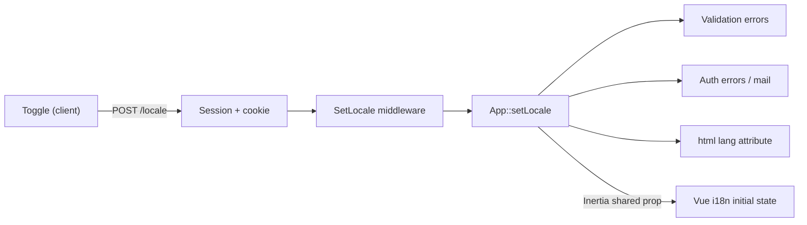

# Japanese Localization Plan

**Project:** Kita Halal Chili Dogs Sapporo
**Status:** Agreed, ready to implement
**Last updated:** 2026-09-18

> All file paths are relative to the `project/` directory (the Laravel application root).

---

## 1. Locked decisions

| #   | Decision                                                                      | Rationale                                                                                                                                           |
| --- | ----------------------------------------------------------------------------- | --------------------------------------------------------------------------------------------------------------------------------------------------- |
| 1   | **Japanese is the primary language. English is supplementary.**               | The business operates in Sapporo; the local market is the primary audience.                                                                         |
| 2   | **English is available only on the public landing page**, via a toggle.       | Every form in the application is staff-facing (public registration is already disabled — see `routes/auth.php`), so no other surface needs English. |
| 3   | **No locale prefix in URLs.** The toggle is client-side rendering.            | Content is single-language, so splitting URLs would create duplicate content for no benefit.                                                        |
| 4   | **The server tracks the active locale** via session + cookie.                 | Required for validation messages, auth errors, and mail — none of which can be produced client-side.                                                |
| 5   | **Database content stays single-language (Japanese), entered by the client.** | No schema change, no translation columns, no translatable-content layer.                                                                            |
| 6   | **Admin, authentication, and profile screens are Japanese only.**             | Staff-facing. Removes roughly 70 English keys and half the label work.                                                                              |
| 7   | **No browser-language auto-detection.** First visit is always Japanese.       | Many Japanese residents run an English-language OS; detection would serve English to the core audience.                                             |
| 8   | **An English visitor sees English labels around Japanese content.**           | Agreed explicitly with the client as an accepted outcome, not a defect.                                                                             |
| 9   | **The brand is `キタハラルチリドッグス札幌` in all Japanese text.**           | Two competing Japanese names existed; see §6.                                                                                                       |

---

## 2. Language matrix

| Surface                                     | Language                                           |
| ------------------------------------------- | -------------------------------------------------- |
| Public landing page (`/`)                   | JA + EN (toggle)                                   |
| Admin dashboard and forms (`/admin/*`)      | JA only                                            |
| Login / password reset / email verification | JA only                                            |
| Profile screens (`/profile`)                | JA only                                            |
| Validation errors, auth errors, mail        | JA only                                            |
| Database content (menu items, locations)    | JA only — authored by the client, never translated |
| Japanese consumers / `<html lang>`          | **JA becomes the effective site language**         |

### SEO consequence (positive)

Making Japanese the default resolves the search-visibility problem rather than working around it:

- Google indexes the Japanese page, which is the correct page for the Sapporo market.
- The English view is a client-side toggle, **not a URL** — so there is no duplicate content, no `hreflang` requirement, and no locale-segmented sitemap.
- Remaining work is limited to correcting metadata that is currently English.

---

## 3. Architecture



**Resolution order:** URL locale (unused today) → session → cookie → `APP_LOCALE` (`ja`).

The browser and the server read the same value from the same source, which removes the class of bug where the UI shows Japanese while the server emits English validation errors.

---

## 4. Change inventory

### A. Language plumbing — new, small

| File                                            | Change                                                                                                                                  |
| ----------------------------------------------- | --------------------------------------------------------------------------------------------------------------------------------------- |
| `.env` / `.env.example`                         | `APP_LOCALE=ja`, `APP_FALLBACK_LOCALE=en`                                                                                               |
| `lang/ja/validation.php`                        | **New.** Messages plus the `attributes` map (see §5)                                                                                    |
| `lang/ja/auth.php`                              | **New.** Login/auth failure messages                                                                                                    |
| `lang/ja/passwords.php`                         | **New.** Password reset status messages                                                                                                 |
| `app/Http/Middleware/SetLocale.php`             | **New.** Resolves and applies locale from an allowlist                                                                                  |
| `app/Http/Middleware/ForceLocale.php`           | **New.** Pins JA on staff route groups so admin never follows the public toggle                                                         |
| `bootstrap/app.php`                             | Register both middleware in the `web` group                                                                                             |
| `routes/web.php`                                | `POST /locale` to persist the toggle                                                                                                    |
| `app/Http/Middleware/HandleInertiaRequests.php` | Share `locale` in `share()`                                                                                                             |
| `resources/views/app.blade.php`                 | **No change.** Already emits `app()->getLocale()`; it has been silently emitting `en` and will start working once the middleware exists |
| Password reset notification                     | JA subject and body (Breeze default is English)                                                                                         |

**No `lang/en/` directory is needed.** Laravel 12 ships English translations inside the framework at `vendor/laravel/framework/src/Illuminate/Translation/lang/en/`.

### B. `resources/js/i18n.js` — approximately 30 lines

- Default locale: `'en'` → `'ja'` (currently a first-time Japanese visitor gets an English first paint).
- Initial state read from the Inertia shared prop instead of `localStorage`.
- **Add `{param}` interpolation to `t()`** — required for the location headline (§4C).
- `toggleLocale()` persists to the server while still updating reactively, so the UX stays instant with no page reload.
- Keep `document.documentElement.lang` in sync.
- The `en` table shrinks to landing-page-only coverage.

### C. Public landing page — the only bilingual surface

| File                                     | Work                                                                                                                                                        |
| ---------------------------------------- | ----------------------------------------------------------------------------------------------------------------------------------------------------------- |
| `Components/Public/Hero.vue`             | Fallback headline and description, badge text, `money()` locale, `alt` text                                                                                 |
| `Components/Public/MenuCard.vue`         | `Sold Out`, 4 spice labels (`Mild`/`Medium`/`Hot`/`Tangy`), 2 badge labels (`Limited Daily Batch`, `Muslin Friendly`), price uses `toLocaleString('en-US')` |
| `Components/Public/MenuGallery.vue`      | Filter labels and empty state                                                                                                                               |
| `Components/Public/AboutStory.vue`       | ~400 words of prose, photo caption, `alt` text                                                                                                              |
| `Components/Public/AllergenInfo.vue`     | Full allergen table body                                                                                                                                    |
| `Components/Public/Faq.vue`              | 5 Q&A pairs (~600 words) plus subtitle — currently trapped inside the component                                                                             |
| `Components/Public/LocationSchedule.vue` | **Structural change — see below**                                                                                                                           |
| `Layouts/PublicLayout.vue`               | JA `<title>`, meta description, keywords, `og:locale=ja_JP` + `og:locale:alternate=en_US`, 3 `aria-label`s                                                  |
| `Pages/Welcome.vue`                      | `title` prop → Japanese                                                                                                                                     |

#### `LocationSchedule.vue` — the only genuine refactor

The headline is an English sentence with interpolated values:

```js
`${fmtDayMonth(loc.schedule_date)} — Today we'll be at ${loc.location_name}${landmark}, from ${hm(loc.start_time)} to ${hm(loc.end_time)}`;
```

Word-order substitution cannot translate this. It becomes a key with parameters — `t('loc.headline', { date, name, landmark, from, to })` — with the Japanese message providing correct word order. `nextLabel` needs the same treatment, and `fmtDayMonth` switches from `'en-US'` to `'ja-JP'` so dates render as `9月17日(水)`.

### D. Staff surfaces — Japanese text, English removed

| File                              | Work                                                                                                                                      |
| --------------------------------- | ----------------------------------------------------------------------------------------------------------------------------------------- |
| `Pages/Admin/Locations/Index.vue` | 14 hardcoded `<label>`s (`Date`, `Location name`, `Landmark note`, `Map pin note`, `Transit note`, …)                                     |
| `Pages/Admin/Menu/Index.vue`      | 14 hardcoded `<label>`s (`Image alt text`, `Spice level`, `Display order`, `Highlight tag 1`, …) plus `<Head title>`                      |
| `Pages/Admin/Accounts/Index.vue`  | `<Head title>`, `Confirm Password`, native `confirm()` dialog                                                                             |
| `Pages/Admin/Dashboard.vue`       | `<Head title>`                                                                                                                            |
| `Layouts/AdminLayout.vue`         | Remove the language toggle (admin is always JA); translate `aria-label`                                                                   |
| `Pages/Auth/*`                    | `ResetPassword.vue`, `ConfirmPassword.vue`, `VerifyEmail.vue` have **zero** keys today; `Login.vue` / `ForgotPassword.vue` partially done |
| `Pages/Profile/*`                 | `Edit.vue` plus 3 partials, **zero** keys, including `placeholder="Password"`                                                             |
| `Pages/Dashboard.vue`             | **Delete.** Dead Breeze leftover — `/dashboard` redirects via `PublicController@dashboardRedirect`                                        |

### E. Japanese typography

The current font stack (`Outfit`, `Plus Jakarta Sans`) contains no kana or kanji, so Japanese is already falling back to Hiragino/Yu Gothic — producing inconsistent headings across macOS, Windows, and Android.

- Add a `:lang(ja)` font stack (e.g. `Noto Sans JP`).
- Neutralize `uppercase tracking-widest` on section eyebrows — meaningless for Japanese and visually wrong on kanji.
- Body line-height 1.625 → approximately 1.8.
- `word-break` handling for long Japanese strings.

### F. Guardrails

- **Key-parity test:** fail when `ja` lacks a key that `en` has. The direction matters — with `ja` as the active locale and `en` as `fallback_locale`, a missing JA key silently renders English. That was graceful degradation when JA was secondary; it is now a visible defect in the primary language.
- Move FAQ and About prose from components into `lang` files so translators and tooling can see it.

---

## 5. Validation messages

`lang/ja/validation.php` alone produces 「name フィールドは必須です。」 — an English field name inside a Japanese sentence. The `attributes` map is what corrects it, and it is the item most commonly missed.

| Field            | JA label           | Field                     | JA label            |
| ---------------- | ------------------ | ------------------------- | ------------------- |
| `name`           | お名前             | `schedule_date`           | 日付                |
| `email`          | メールアドレス     | `location_name`           | 場所名              |
| `password`       | パスワード         | `address`                 | 住所                |
| `price_yen`      | 価格               | `landmark_note`           | 目印                |
| `description`    | 説明               | `start_time` / `end_time` | 開始時刻 / 終了時刻 |
| `image`          | 画像               | `event_name`              | イベント名          |
| `image_alt_text` | 画像の代替テキスト | `latitude` / `longitude`  | 緯度 / 経度         |

These cover `LocationRequest`, `MenuItemRequest`, `ProfileUpdateRequest`, and every request under `app/Http/Requests/Auth/`.

---

## 6. Brand name standardization

**Standard: `キタハラルチリドッグス札幌`** — used everywhere the brand appears, in both languages. The header wordmark is no longer locale-dependent and always renders the Japanese name.

Current inconsistencies to correct:

| Location                             | Current                                                  | Action                                                                                                                                     |
| ------------------------------------ | -------------------------------------------------------- | ------------------------------------------------------------------------------------------------------------------------------------------ |
| `i18n.js` → `auth.signInHint`        | `キタチリドッグスの管理画面にログインします。`           | Replace with the standard name                                                                                                             |
| `i18n.js` → `foot.rights`            | `© 2026 キタハラルチリドッグス札幌 All rights reserved.` | Keep the name; remove the English legal suffix (JA is primary)                                                                             |
| `PublicLayout.vue`                   | Latin wordmark `KITA CHILI DOGS`                         | **Done** — replaced with `キタハラルチリドッグス札幌`; mobile size reduced to `text-base` so 12 full-width characters still fit the header |
| `PublicLayout.vue`, `AboutStory.vue` | `aria-label`s and `alt` text using the Latin brand name  | Logo `aria-label` **done**; `AboutStory.vue` `alt` text pending Phase 2                                                                    |

Related terminology drift to resolve at the same time:

| Keys                                    | Current                                                                  | Action                                     |
| --------------------------------------- | ------------------------------------------------------------------------ | ------------------------------------------ |
| `nav.dietary` vs `mnav.dietary`         | `ハラル・アレルギー` vs `ハラル認証・アレルギー`                         | Same destination, two labels — unify       |
| `admin.dash.tip` + `admin.dash.profile` | One sentence split across two keys, ending mid-clause at 「…の場合は、」 | Merge into a single key with interpolation |

---

## 7. Phasing

| Phase | Work                                                                                | Effort |
| ----- | ----------------------------------------------------------------------------------- | ------ |
| **0** | Lock the glossary and brand name; client reviews existing JA strings                | S      |
| **1** | Language plumbing (§4A) plus `i18n.js` changes (§4B)                                | M      |
| **2** | Public landing page extraction (§4C), including the `LocationSchedule.vue` refactor | M      |
| **3** | Staff surfaces (§4D) and deletion of dead `Dashboard.vue`                           | M      |
| **4** | Japanese typography pass (§4E)                                                      | S      |
| **5** | Translation QA with the client; key-parity test; locale live check                  | S      |

**Ordering constraint:** Phase 1 must land before Phase 2. The moment `APP_LOCALE=ja` takes effect, every admin form begins producing Japanese validation messages — which surfaces the `attributes` gap (§5) immediately.

---

## 8. Explicitly out of scope

- **No database changes.** No migrations, no schema edits, no locale columns, no translation tables. `menu_items` and `locations` keep their exact current structure.
- No URL restructuring, no `hreflang`, no locale-separated sitemap, no duplicate-content handling.
- **No new Composer or npm dependencies.**
- No changes to `MenuFeaturingService`, controller logic, or existing tests.
- No English content for menu items or locations.
- No new public booking or contact form (the footer link remains an email link).

---

## 9. Open items

1. **The ~1,000 words of new Japanese copy** (FAQ ~600 words, About ~400 words, allergen table). The client must either write this or approve what we draft.
2. **Allergen and halal certification wording must be reviewed by the client.** These are regulated claims; machine translation is not acceptable for this section.

---

## 10. Risks

| Risk                                                                   | Mitigation                                                           |
| ---------------------------------------------------------------------- | -------------------------------------------------------------------- |
| Missing JA key silently falls back to English, in the primary language | Key-parity test in Phase 5                                           |
| Brand/terminology drift re-emerging as new strings are added           | Glossary locked in Phase 0; enforced in review                       |
| Japanese typography regressions across platforms                       | `:lang(ja)` font stack plus a cross-platform visual check in Phase 4 |
| Form error text reading as machine-translated Japanese                 | `attributes` map (§5) plus client review of the JA message files     |
| Scope creep into content translation, which was explicitly excluded    | §8 recorded in writing                                               |

---

## 11. Sprint plan — vertical slices

§7 lists the work **horizontally** (all plumbing, then all public text, then all staff text). The sprints below are the same work arranged as **vertical slices**: each sprint ends with a journey the client can actually click through, spanning server (validation, mail, `html lang`), client (labels), and typography together.

Because the database is out of scope (§8), a "slice" here is a **user journey**, not a data feature. The slices are ordered so the riskiest architectural assumption is proven **first**, not last.

| #     | Vertical outcome (demonstrable)                                                                                                          | Covers                     | New | Changed | Deleted | JA keys | Effort       |
| ----- | ---------------------------------------------------------------------------------------------------------------------------------------- | -------------------------- | --- | ------- | ------- | ------- | ------------ |
| **1** | An admin logs in and manages a location entirely in Japanese — labels, dates, and **validation messages**                                | §4A, §4B, slice of §4D     | 6   | 9       | 1       | +35     | 2–3 d        |
| **2** | A visitor lands on `/` and the header, nav, footer, and metadata are Japanese; the EN toggle persists across reloads; `<html lang="ja">` | §4C (chrome), §4E (header) | 0   | 3       | 0       | +12     | 1–2 d        |
| **3** | The "find us and eat" journey reads as Japanese: Hero → Location schedule → Menu gallery → Menu cards                                    | §4C (transactional)        | 0   | 4       | 0       | +40     | 2–3 d        |
| **4** | The "trust" journey reads as Japanese: About → Allergen table → FAQ                                                                      | §4C (long-form)            | 0   | 4       | 0       | +25     | 2 d + review |
| **5** | Every remaining staff screen is Japanese with no English stragglers: menu form, accounts, dashboard, auth, profile                       | §4D (remainder)            | 0   | 13      | 1       | +45     | 2–3 d        |
| **6** | Hardening: JA typography everywhere, key-parity test, dead-key removal, cross-platform check                                             | §4E, §4F, §7 phase 5       | 1   | 4       | 0       | −10     | 1–2 d        |

**Total: roughly 10–15 developer days**, excluding client review turnaround.

### Why this order

- **Sprint 1 is the architecture proof.** It is the only slice where the _server_ produces user-visible text (validation errors, auth errors, mail). If `SetLocale` + `lang/ja/validation.php` + the `attributes` map work there, everything left in the programme is text extraction — low risk and parallelisable. If it does not work, the problem surfaces in week one rather than week five.
- **Sprint 2 carries the highest visibility per unit of effort.** The site is visually Japanese after roughly three days, which is what makes the work legible to the client.
- **Sprint 4 is externally blocked.** It needs ~1,000 words of new Japanese copy plus regulated allergen wording (§9). **Start that review during Sprint 1, not Sprint 4** — it is the only long-latency dependency in the plan and the usual cause of a slip.
- **Sprints 3 and 5 are independent** and can be swapped or run in parallel if two people are available.

### Total change volume

| Metric                     | Current | After        |
| -------------------------- | ------- | ------------ |
| JA keys in `i18n.js`       | 113     | ~200         |
| EN keys in `i18n.js`       | 113     | ~95          |
| JS files changed           | —       | ~24 of ~28   |
| JS files deleted           | —       | 2            |
| PHP files created          | —       | 6            |
| PHP / config files changed | —       | 5            |
| New Japanese copy          | —       | ~1,000 words |
| New dependencies           | —       | **0**        |

The EN table _shrinks_ because admin (51 keys) and auth (21 keys) become JA-only, which more than offsets the new public keys. The JA table roughly doubles.

### Dead code found while sizing this

Two Vue files are unreferenced and should be **deleted rather than translated**:

| File                      | Why it is dead                                                                                                                          |
| ------------------------- | --------------------------------------------------------------------------------------------------------------------------------------- |
| `Pages/Dashboard.vue`     | `/dashboard` redirects via `PublicController@dashboardRedirect`; only this file's own import references `AuthenticatedLayout` from here |
| `Pages/Auth/Register.vue` | Public registration was **intentionally removed** (`routes/auth.php`); nothing routes to it. Removes 6 `auth.register*` keys per locale |

`AuthenticatedLayout.vue` and `GuestLayout.vue` are **not** dead — the former is used by `Profile/Edit.vue`, the latter by all five remaining auth pages.

### Sizing basis

Measured, not estimated: `i18n.js` = 301 lines / 226 key lines = **113 keys per locale** (admin 51, auth 21, public 41). 25 Vue files totalling 3,181 lines. The +35 / +40 / +45 JA-key figures are derived from the actual hardcoded strings counted in §4C and §4D (28 `<label>`s in the admin forms, plus the enumerated section bodies).
